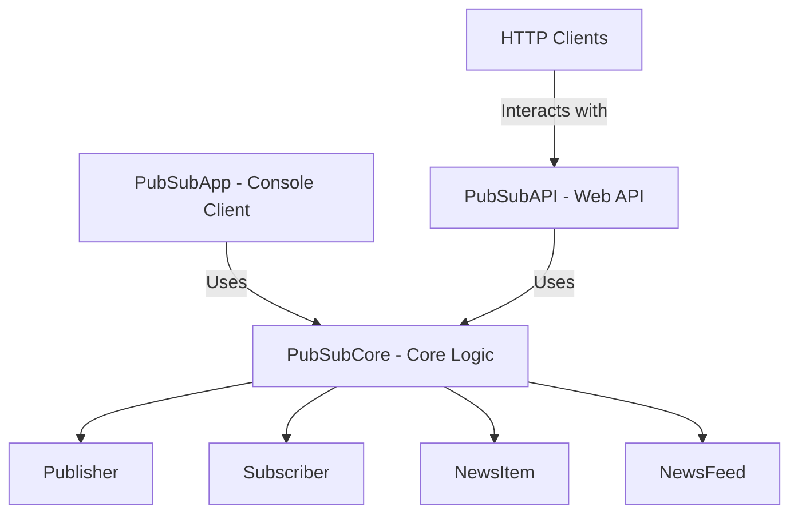

# PubSub System

## Overview
This repository contains a simple Publish-Subscribe (PubSub) system implemented in .NET. It demonstrates a core PubSub mechanism, an ASP.NET Core Web API for interaction, and a console application for rigorous testing of the core logic.

The system allows "Publishers" to publish news items on various topics, and "Subscribers" to subscribe to publishers to receive news. Subscribers only receive news items published *after* they subscribe.

## Architecture
The project is structured into three main components:

1.  **PubSubCore**: This is the heart of the system, containing the fundamental domain logic and entities.
    *   `Publisher`: Represents an entity that can publish news. It maintains its own news feed.
    *   `Subscriber`: Represents an entity that can subscribe to publishers and receive news. It manages its subscriptions and retrieves news from subscribed publishers.
    *   `NewsItem`: A data structure representing a single piece of news with a title, body, and timestamp.
    *   `NewsFeed`: Manages a collection of `NewsItem` objects for a publisher.

2.  **PubSubAPI**: An ASP.NET Core Web API that exposes the PubSub functionality through RESTful endpoints.
    *   **Controllers**: `PublishersController` and `SubscribersController` handle incoming HTTP requests for publisher and subscriber management, respectively.
    *   **Models**: Defines Data Transfer Objects (DTOs) for requests and responses (e.g., `PublisherRequest`, `PublisherResponse`, `SubscriberRequest`, `SubscriberResponse`, `PublishRequest`).
    *   **Services**: `PubSubService` acts as an intermediary, orchestrating interactions between the API controllers and the `PubSubCore` logic.

3.  **PubSubApp**: A console application designed to rigorously test the `PubSubCore` library. It simulates various scenarios of publishers publishing news and subscribers subscribing/unsubscribing, demonstrating how news is received based on subscription timings.

### Diagram


## Setup and Run Locally

### Prerequisites
*   .NET SDK 8.0 or higher

### Steps
1.  **Clone the repository:**
    ```bash
    git clone https://github.com/your-repo/pubsub-api.git
    cd pubsub-api/PubSub
    ```
    *(Note: Replace `https://github.com/your-repo/pubsub-api.git` with the actual repository URL if different.)*

2.  **Run the PubSubAPI (Web API):**
    Navigate to the `PubSubAPI` directory and run the application.
    ```bash
    cd PubSubAPI
    dotnet run
    ```
    The API will typically run on `http://localhost:5000` or `http://localhost:5001` (HTTPS). You can access the Swagger UI at `/swagger` (e.g., `http://localhost:5001/swagger`).

3.  **Run the PubSubApp (Console Test Client):**
    In a separate terminal, navigate to the `PubSubApp` directory and run the application.
    ```bash
    cd PubSubApp
    dotnet run
    ```
    This will execute the rigorous test cases and print the output to the console.

## Setup and Run with Docker

### Prerequisites
*   Docker Desktop installed and running

### Steps
1.  **Build the Docker image:**
    Navigate to the `PubSub` directory (where the `Dockerfile` is located).
    ```bash
    docker build -t pubsub-api .
    ```

2.  **Run the Docker container:**
    ```bash
    docker run -p 8080:8080 pubsub-api
    ```
    This will start the PubSubAPI inside a Docker container, mapping port 8080 of the container to port 8080 on your host machine. The API will be accessible at `http://localhost:8080`. You can access the Swagger UI at `http://localhost:8080/swagger`.
